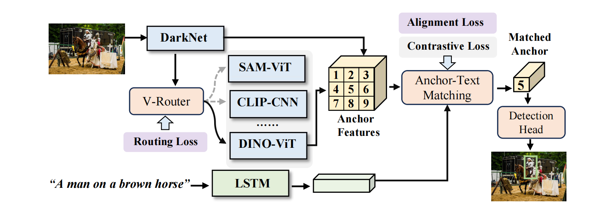
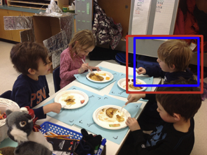
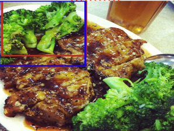
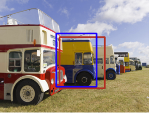
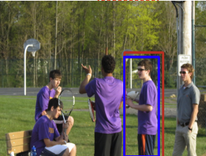

# DViN
[](https://www.python.org/)


This repo is the official implementation of the paper "DViR: Dynamic Visual Routing for Weakly Supervised Referring Expression Comprehension"


## Project structure

The directory structure of the project looks like this:

```txt
├── README.md            <- The top-level README for developers using this project.
│
├── config               <- configuration 
│
├── data
│   ├── anns            <- note: cat_name.json is for prompt template usage
│
├── datasets               <- dataloader file
│
│
├── models  <- Source code for use in this project.
│   │
│   ├── language_encoder.py             <- encoder for images' text descriptions 
│   ├── network_blocks.py               <- files included essential model blocks 
│   ├── clip_encoder.py                  <- encoder for extracting CLIP model embeddings 
│   ├── sam_encoder.py                  <- encoder for extracting SAM model embeddings 
│   ├── visual_encoder.py               <- visual backbone ,also includes prompt template encoder
│   │
│   │
│   ├── DViN           <- most important files for DViN model implementations
│   │   ├── __init__.py
│   │   ├── head.py   <- for anchor-prompt contrastive loss
|   |   ├── net.py    <- main code for DViN model
│   │
│   │
├── utils  <- hepler functions
├── requirements.txt     <- The requirements file for reproducing the analysis environment
│── train.py   <- script for training the model
│── test.py <- script for testing from a model
│
└── LICENSE              <- Open-source license if one is chosen
```

## Installation 
Instructions on how to clone and set up your repository:

### Clone this repo :

- Clone the repository and navigate to the project directory:

```bash
git clone https://github.com/XxFChen/DViN.git
cd DViN
```

### Create a conda virtual environment and activate it:
```bash
conda create -n DViN python=3.9 -y
conda activate DViN
```
### Install the required dependencies:
- Install Pytorch following the [offical installation instructions](https://pytorch.org/get-started/locally/) 

(We run all our experiments on pytorch 1.11.0 with CUDA 11.3)

- Install apex following the [official installation guide](https://github.com/NVIDIA/apex#quick-start) for more details.

(or use the following commands we copied from their offical repo)
```bash
git clone https://github.com/NVIDIA/apex
cd apex
# if pip >= 23.1 (ref: https://pip.pypa.io/en/stable/news/#v23-1) which supports multiple `--config-settings` with the same key... 
pip install -v --disable-pip-version-check --no-cache-dir --no-build-isolation --config-settings "--build-option=--cpp_ext" --config-settings "--build-option=--cuda_ext" ./
# otherwise
pip install -v --disable-pip-version-check --no-cache-dir --no-build-isolation --global-option="--cpp_ext" --global-option="--cuda_ext" ./
```
#### Compile the DCN layer:
```bash
cd utils/DCN
./make.sh
```
#### Install remaining dependencies
```bash
pip install -r requirements.txt
wget https://github.com/explosion/spacy-models/releases/download/en_vectors_web_lg-2.1.0/en_vectors_web_lg-2.1.0.tar.gz -O en_vectors_web_lg-2.1.0.tar.gz
pip install en_vectors_web_lg-2.1.0.tar.gz
```
### Data Preparation
- Download images and Generate annotations according to [SimREC](https://github.com/luogen1996/SimREC/blob/main/DATA_PRE_README.md) 

(We also prepared the annotations inside the data/anns folder for saving your time)

- Download the pretrained weights of YoloV3 from [Google Drive](https://drive.google.com/file/d/1nxVTx8Zv52VSO-ccHVFe2ggG0HbGnw9g/view?usp=sharing) 

(We recommend to put it in the main path of DViN otherwise, please modify the path in config files)

- The data directory should look like this:

```txt
├── data
│   ├── anns            
│       ├── refcoco.json            
│       ├── refcoco+.json              
│       ├── refcocog.json                 
│       ├── refclef.json
│       ├── cat_name.json       
│   ├── images 
│       ├── train2014
│           ├── COCO_train2014_000000515716.jpg              
│           ├── ...
│       ├── refclef
│           ├── 99.jpg              
│           ├── ...

... the remaining directories    
```
- NOTE: our YoloV3 is trained on COCO’s training images, excluding those in RefCOCO, RefCOCO+, and RefCOCOg’s validation+testing

## Training 

```bash
python train.py --config ./configs/[DATASET_NAME].yaml
```
## Evaluation

```bash 
python test.py --config ./config/[DATASET_NAME].yaml --eval-weights [PATH_TO_CHECKPOINT_FILE]
```

## Model Zoo

### Weakly REC 
| Method | RefCOCO | | | RefCOCO+ | | | RefCOCOg |
| ------ | ------- | ------- | ------- | ------- | ------- | ------- | ------- |
|        | val     | testA   | testB   | val     | testA   | testB   | val-g   |
| DViN    | 67.67   | 70.90  | 59.39   | 52.54   | 57.52   | 45.31   | 55.04   |

### Weakly RES
| Method | RefCOCO | | | RefCOCO+ | | | RefCOCOg |
| ------ | ------- | ------- | ------- | ------- | ------- | ------- | ------- |
|        | val     | testA   | testB   | val     | testA   | testB   | val-g   |
| DViN    | 61.43   | 63.81   | 56.97   | 46.79   | 51.87   | 39.85  | 46.49   |

### Pesudo Labels to training other models ( Weakly Supervsied Training Schema)

| Method            | RefCOCO |        |        | RefCOCO+ |        |        | RefCOCOg |
| ----------------- | ------- | ------ | ------ | -------- | ------ | ------ | -------- |
|                   | val     | testA  | testB  | val      | testA  | testB  | val-g    |
| DViN_SimREC    | 67.29   | 73.09  | 60.65  | 51.54    | 59.06  | 39.59  | 51.73    |
| DViN_TransVG   | 64.99   | 68.87  | 64.48  | 50.72 |57.36| 38.64  | 50.47     |


## Visualization Prediction Results (Blue box is ground truth)

Image Description :  "Kid on right in back blondish hair"



Image Description :  "Top broccoli"



Image Description :  "Yellow and blue vehicle close to the camera"



Image Description :  "Second from the right"




